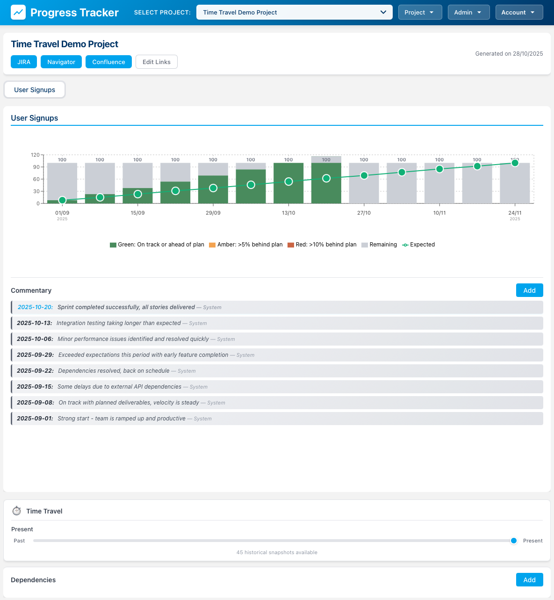

# Progress Tracker

**Understand where your project stands using numbers, not words.**

A modern web application for tracking project metrics and progress across multiple initiatives. Define how your key metrics should evolve and track their trajectory over time with intelligent automation and role-based access control.



*Interactive dashboard showing project metrics, progress charts, and real-time tracking*

## 🌐 Live Demo

Visit our [showcase site](https://datavisuals.github.io/progress-tracker/) to explore all features.

## Core Value Proposition

Stop relying on vague status updates like "we're making good progress." Progress Tracker helps you:

- **Define Expected Trajectories**: Set expected, target, and actual values for each metric
- **Visualize the Gap**: See instantly when reality diverges from your plan
- **Track Over Time**: Monitor how metrics evolve across weekly, monthly, or quarterly periods
- **Act on Data**: Make informed decisions based on quantitative progress indicators

## ✨ Latest Features

### ⏪ **Time Travel Revert** (Admin Only)
Restore project data to any historical state:
- **Full State Restoration**: Revert all metrics to their exact state at any point in time
- **Comprehensive Changes**: Updates values, restores deleted periods, removes periods added after target time
- **Admin-Only Protection**: Only administrators can perform revert operations
- **Full Audit Trail**: All revert actions logged with detailed change counts
- **Reversible**: Revert operations themselves are logged, allowing "undo" via time travel
- **Smart Confirmation**: Shows exactly what will happen before reverting
- **Change Summary**: Displays counts of updated, deleted, restored, and unchanged records

### ✏️ **Enhanced Inline Editing**
Streamlined editing experience with improved UX:
- **Auto-Select First Metric**: Edit Data modal automatically selects first metric
- **Compact Modal Size**: Data grid now sizes to content for better screen utilization
- **Copy/Paste Support**: Full clipboard support in numeric fields (changed from type="number" to type="text" with inputMode="numeric")
- **Future Period Protection**: Complete field automatically disabled for future periods (greyed out, read-only)
- **Consolidated Headers**: Reduced vertical space by combining header sections
- **Project Date Editing**: Double-click project timeline to edit start/end dates inline

### 📊 **Improved Metric Management**
Better handling of metrics and schedules:
- **Orphaned Metrics Support**: Metrics without periods remain visible in UI
- **Smart Metric Lookup**: Bulk add and single row add work correctly for metrics with no existing periods
- **Proper Placeholder Display**: Shows "No Schedule Defined" when metric exists but has no periods
- **Clean Error Handling**: Clear error messages when metric operations fail

### 📥 **Excel Import** (Admin/PM)
Bulk import project data to quickly set up or update multiple projects:
- **Prescriptive Template**: Download Excel template with examples and instructions
- **Comprehensive Validation**: Detailed error reporting with row/column identification
- **Smart Upsert**: Create new projects or update existing ones (no deletions)
- **Auto-Detection**: Automatically detects metric frequency from date intervals
- **Import Results**: See exactly what was created/updated with statistics

### 🔍 **Data Consistency Reports** (Admin)
Automated data quality analysis to identify potential issues:
- **Vacation Month Detection**: Flags unusual progress during January and December
- **Front-Loaded Growth**: Identifies rapid early progress patterns
- **Back-Loaded Growth**: Detects disproportionate end-of-project progress
- **Single Metric Projects**: Highlights projects with insufficient tracking
- **Severity Levels**: High, Warning, and Info classifications
- **Direct Navigation**: Click to jump to flagged projects

### 🔗 **Project Links**
Organize external resources and documentation:
- **Unlimited Links**: Add as many reference links as needed
- **Custom Labels**: Name each link descriptively
- **Display Order**: Organize links in your preferred sequence
- **Quick Access**: One-click navigation to tools, docs, and dashboards

### 👤 **User Profile Management**
Self-service account management:
- **Update Profile**: Change name and email address
- **Password Changes**: Secure updates with current password verification
- **Session Persistence**: Stay logged in across changes

## 🎯 Key Features

### Project Management
- **Multi-Project Dashboard**: Track unlimited projects with individual metrics
- **Streamlined Setup**: Single-screen project creation capturing all details
- **Project Permissions**: Granular access control for teams
- **Initiative Manager Tracking**: Assign ownership and accountability

### Visual Analytics
- **Interactive Progress Charts**:
  - Stacked bars showing completed vs remaining work
  - Expected progress line (green) with draggable adjustment points
  - Actual progress tracking with variance indicators
  - Current period highlighting
  - Target line showing scope changes over time
- **Smart Date Formatting**: Automatically displays month names for monthly data
- **Real-Time Updates**: Charts refresh dynamically as data changes

### Progression Curves

Choose from three progression models when creating metrics:

#### 1. **Linear** - Equal Progress Each Period
- **Formula**: `y = x`
- **Pattern**: Steady, predictable increments
- **Best for**: Manufacturing, routine tasks, predictable work
- **Example**: Complete 10 units per month for 10 months = 100 units

#### 2. **S-Curve** - Slow/Fast/Slow Growth
- **Formula**: `y = 1/(1 + e^(-10(x-0.5)))` (Sigmoid/Logistic)
- **Pattern**: Slow ramp-up → rapid growth → gradual plateau
- **Best for**: Technology adoption, organizational transformation, learning curves
- **Example**: Software rollout - pilot phase (slow), mass adoption (fast), stabilization (slow)
- **Note**: This is a **sigmoid curve**, not exponential. Exponential curves grow continuously without plateau.

#### 3. **Front-Loaded** - Fast Start, Gradual Finish
- **Formula**: `y = √x` (Square root/Logarithmic)
- **Pattern**: Fast initial progress → diminishing returns
- **Best for**: Research, initial development, quick wins, bug fixing
- **Example**: Bug fixing - many easy bugs fixed early, harder bugs take longer

**Note**: The Data Consistency Report detects **back-loaded** growth patterns (opposite of front-loaded), which may indicate end-of-period gaming or unrealistic early projections.

### Data Management
- **Smart Data Grid**:
  - Inline editing for all metrics with auto-select on open
  - Target value propagation - change once, update all periods
  - Bulk period creation with configurable frequency
  - Add/remove periods on the fly with immediate delete
  - Full copy/paste support in numeric fields
  - Future period protection - completion disabled for upcoming periods
  - Compact, auto-sizing modal that fits content
  - Orphaned metrics support - metrics without periods remain visible
  - Consolidated header design for better space utilization
- **Project Editing**:
  - Double-click project name to rename inline
  - Double-click project description to edit inline
  - Double-click project timeline to edit start/end dates inline
  - All changes validated and immediately reflected
- **Draggable Expected Line**: Adjust expected values directly on charts
- **Flexible Data Entry**: Support for expected, target, and completion tracking

### Commentary System
- **Period-Specific Notes**: Add contextual commentary to any reporting period
- **Visual Highlighting**: Latest comments marked with indicators
- **Chronological Sorting**: Most recent updates first
- **Inline Editing**: Update commentary from chart view

### CRAID Management
Track Concerns, Risks, Assumptions, Issues, and Dependencies:
- **Priority Levels**: Critical, High, Medium, Low with color coding
- **Status Tracking**: Open, In Progress, Closed with visual badges
- **Age-Based Alerts**: Automatic highlighting of stale items
- **Rich Details**: Title, description, owner, due dates, resolution tracking

### Authentication & Security
**Role-Based Access Control (RBAC)**:
- **Admin**: Full system access, user management, audit logs, consistency reports
- **Project Manager (PM)**: Create projects, manage assigned projects, edit data, bulk import
- **Viewer**: Read-only access to all projects

**Security Features**:
- JWT-based authentication with bcrypt password hashing
- Secure session management
- User profile and password management
- Enhanced login UX with clear error feedback

### Audit & Compliance
- **Comprehensive Audit Log**: Track all changes with user, action, timestamp, and IP
- **Historic Edit Protection**: Safeguard data integrity
  - Completion values for past periods (after end date) restricted to admins
  - Historic edits marked with ⚠️ HISTORIC EDIT in audit log
  - Prevents retroactive manipulation while allowing authorized corrections
- **Time Travel Feature** (Admin/PM): View and restore historical project state
  - Reconstructs complete data state from audit log at any point in time
  - Shows exact values and commentary as they appeared
  - Interactive timeline slider for exploring project history
  - **Revert to Historical State** (Admin only):
    - Restore all project data to any previous state with one click
    - Updates current values, restores deleted periods, removes periods added after target time
    - Full audit trail of revert actions with change counts
    - Reversible - revert operations can themselves be reverted via time travel
    - Protected by admin-only permissions
- **Filterable History**: Search and filter audit events by user, action, date

### Data Export & Import
- **Automated Excel Exports**: Daily scheduled exports at midnight GMT
- **Manual Export**: On-demand export via API
- **Bulk Import**: Upload Excel files to create/update projects (see Latest Features)
- **Comprehensive Data**: All projects, metrics, periods, and CRAIDs

### User Experience
- **Responsive Design**: Works on desktop, tablet, and mobile
- **Modern UI**: Clean, professional interface
- **Real-Time Feedback**: Instant visual confirmation
- **Error Handling**: Clear, helpful error messages
- **Loading States**: Smooth transitions

## 🛠 Tech Stack

### Frontend
- **React 18** - Component-based architecture with hooks
- **Vite** - Fast build tool and dev server
- **Recharts** - Composable charting library
- **Axios** - HTTP client with interceptors
- **React Icons** - Icon library
- **React Select** - Advanced select components

### Backend
- **Node.js** - JavaScript runtime
- **Express** - Web framework
- **SQLite** - Embedded relational database
- **JWT** - Token-based authentication
- **bcrypt** - Secure password hashing
- **node-cron** - Task scheduler
- **ExcelJS** - Excel file generation and parsing
- **multer** - File upload handling

### Deployment
- **Docker** - Containerization for easy deployment
- **Docker Compose** - Multi-container orchestration
- **Nginx** - Reverse proxy and static file serving (production)
- **Multi-stage builds** - Optimized container images

## 🚀 Getting Started

### Prerequisites
- Node.js 16 or higher
- npm or yarn
- Modern web browser
- **OR** Docker (for containerized deployment)

### Quick Start with Docker 🐳

The fastest way to run Progress Tracker:

```bash
# Clone and enter directory
git clone https://github.com/DataVisuals/progress-tracker.git
cd progress-tracker

# Build and run with Docker
make build
make run

# Access the application
# - Backend: http://localhost:3001
# - Frontend: http://localhost:5173
```

**Default login credentials:**
- Admin: admin@example.com / admin123
- PM: pm@example.com / pm123
- Viewer: viewer@example.com / viewer123

For detailed Docker documentation, see [README-DOCKER.md](./README-DOCKER.md) or [DOCKER.md](./DOCKER.md).

### Installation (Local Development)

1. **Clone the repository:**
```bash
git clone https://github.com/DataVisuals/progress-tracker.git
cd progress-tracker
```

2. **Install dependencies:**
```bash
# Backend
cd backend
npm install

# Frontend
cd ..
npm install
```

3. **Initialize database with sample data:**
```bash
cd backend
node src/migrate-mock-data.js
```

This creates default users:
- **Admin**: admin@example.com / admin123
- **PM**: pm@example.com / pm123
- **Viewer**: viewer@example.com / viewer123

### Running the Application

1. **Start backend** (from backend directory):
```bash
node src/server.js
```
- Backend API: http://localhost:3001
- Automatic database initialization
- Daily export scheduler starts

2. **Start frontend** (from root directory):
```bash
npm run dev
```
- Frontend: http://localhost:5173
- Hot module replacement enabled

3. **Login** with credentials above

## 📁 Project Structure

```
progress-tracker/
├── backend/
│   ├── data/                     # SQLite database
│   ├── exports/                  # Daily Excel exports
│   ├── uploads/                  # Temporary import uploads
│   └── src/
│       ├── server.js            # Express API with routes
│       ├── db.js                # Database utilities
│       ├── permissions.js       # RBAC checks
│       ├── scheduler.js         # Export automation
│       ├── exportService.js     # Excel export logic
│       ├── importService.js     # Excel import & validation
│       └── migrate-mock-data.js # Sample data seeding
├── src/
│   ├── components/              # React components
│   │   ├── ImportData.jsx      # Import modal
│   │   ├── ConsistencyReport.jsx # Data quality reports
│   │   ├── MetricChart.jsx     # Interactive charts
│   │   ├── DataGrid.jsx        # Inline editor
│   │   ├── ProjectSetup.jsx    # Project wizard
│   │   └── ...
│   ├── api/client.js           # Axios HTTP client
│   ├── App.jsx                 # Main application
│   └── App.css                 # Global styles
├── docs/                        # GitHub Pages site
│   ├── index.html              # Landing page
│   ├── features.html           # Feature showreel
│   └── assets/                 # CSS, JS, images
├── import-template.xlsx         # Excel import template
└── README.md
```

## 📊 Database Schema

### Core Tables
- **users**: Authentication and roles
- **projects**: Project definitions
- **project_permissions**: PM access control (many-to-many)
- **project_links**: External resource links
- **metrics**: Metric definitions with schedules
- **metric_periods**: Time-series data points
- **comments**: Period commentary
- **craids**: Risks, issues, dependencies
- **audit_log**: System change tracking

## 🔑 API Endpoints

### Authentication
- `POST /api/auth/login` - User login
- `POST /api/auth/register` - New user registration
- `POST /api/auth/change-password` - Password update
- `PUT /api/auth/profile` - Update profile

### Projects
- `GET /api/projects` - List accessible projects
- `POST /api/projects` - Create project (Admin/PM)
- `PUT /api/projects/:id` - Update project
- `DELETE /api/projects/:id` - Delete project

### Data
- `GET /api/projects/:id/data` - Get metrics and periods
- `GET /api/projects/:id/data/time-travel` - Historical state
- `POST /api/metric-periods` - Create period
- `PUT /api/metric-periods/:id` - Update period
- `PATCH /api/metric-periods/:id` - Partial update

### Import/Export
- `GET /api/import/template` - Download import template (Admin/PM)
- `POST /api/import` - Upload import file (Admin/PM)
- `GET /api/export` - Generate Excel export

### Admin
- `GET /api/users` - List users
- `PUT /api/users/:id/role` - Update user role
- `DELETE /api/users/:id` - Delete user
- `GET /api/audit` - Audit log with filters
- `GET /api/admin/consistency-report` - Data quality report

## 🎓 Key Concepts

### Target Propagation
When editing target values:
1. Change any period's target
2. All subsequent periods update automatically
3. Maintains consistency across timeline

### Draggable Expected Line
Adjust expected values on charts:
1. Hover over green dots
2. Drag up/down
3. Visual feedback shows new value
4. Release to save

### Historic Edit Protection
- Completion values for past periods locked to admins
- Prevents retroactive manipulation
- Audit trail marks historic edits
- Ensures data integrity

## 🐳 Docker Deployment

Progress Tracker includes full Docker support for easy deployment:

### Quick Deploy
```bash
make build    # Build Docker image
make run      # Start application
make logs     # View logs
make stop     # Stop application
```

### Production Deploy with Nginx
```bash
make production
# Access at http://localhost
```

### Available Commands
- `make build` - Build Docker image
- `make run` - Start containers
- `make stop` - Stop containers
- `make logs` - View logs (follow mode)
- `make backup` - Backup database
- `make restore` - Restore database
- `make health` - Check container health
- `make shell` - Access container shell
- `make clean` - Remove containers and images

### Features
- ✅ Multi-stage builds (~200-300MB image)
- ✅ Database persistence via volumes
- ✅ Health checks for monitoring
- ✅ Production-ready Nginx configuration
- ✅ Automated daily exports
- ✅ Easy backup and restore

**Documentation:**
- Quick start: [README-DOCKER.md](./README-DOCKER.md)
- Detailed guide: [DOCKER.md](./DOCKER.md)
- Cloud deployment examples included

## 🤝 Contributing

Contributions welcome! Please:
1. Fork the repository
2. Create a feature branch
3. Make your changes
4. Submit a pull request

## 📄 License

MIT License - free for personal and commercial use.

## 💬 Support

- **Issues**: Open on GitHub
- **Documentation**: Check this README
- **Live Demo**: https://datavisuals.github.io/progress-tracker/

---

**Made with ❤️ for project managers who need clarity and control**
