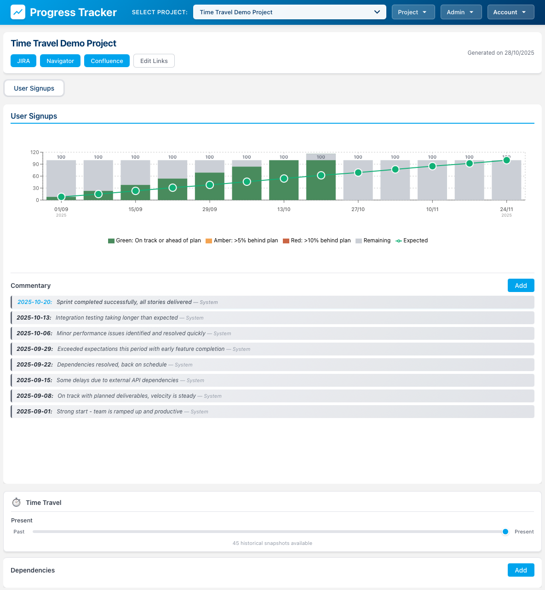

# Progress Tracker

A modern web application for tracking project metrics, milestones, and progress across multiple initiatives.



## Features

- **Project Management**: Track multiple projects with detailed metrics
- **Visual Progress Charts**: Interactive charts showing:
  - Completed vs remaining work
  - Expected vs actual progress
  - Scope changes over time
  - Current period highlighting
- **Commentary System**: Add contextual notes to specific reporting periods
- **CRAID Management**: Track Challenges, Risks, Actions, Issues, and Dependencies
  - Priority levels (Critical, High, Medium, Low)
  - Status tracking (Open, In Progress, Closed)
  - Age-based visual indicators
- **Data Management**: Bulk add periods, edit metrics, and manage project data
- **Authentication**: Secure login system with user management

## Tech Stack

### Frontend
- React 18 with Vite
- Recharts for data visualization
- Axios for API communication
- React Icons

### Backend
- Node.js with Express
- SQLite database
- JWT authentication
- bcrypt for password hashing

## Getting Started

### Prerequisites
- Node.js 16+ 
- npm or yarn

### Installation

1. Clone the repository:
```bash
git clone <repository-url>
cd progress-tracker
```

2. Install backend dependencies:
```bash
cd backend
npm install
```

3. Install frontend dependencies:
```bash
cd ../
npm install
```

4. Initialize the database with mock data:
```bash
cd backend
node src/migrate-mock-data.js
```

### Running the Application

1. Start the backend server (from backend directory):
```bash
node src/server.js
```
The backend will run on http://localhost:3001

2. Start the frontend dev server (from root directory):
```bash
npm run dev
```
The frontend will run on http://localhost:5174

3. Login with default credentials:
- Email: admin@example.com
- Password: admin123

## Project Structure

```
progress-tracker/
├── backend/
│   ├── data/              # SQLite database
│   ├── src/
│   │   ├── server.js      # Express API server
│   │   ├── db.js          # Database connection
│   │   ├── migrate-mock-data.js  # Data seeding
│   │   └── schema-v2.sql  # Database schema
│   └── package.json
├── src/
│   ├── components/        # React components
│   │   ├── MetricChart.jsx
│   │   ├── CRAIDs.jsx
│   │   ├── DataGrid.jsx
│   │   └── Login.jsx
│   ├── api/
│   │   └── client.js      # API client
│   ├── App.jsx
│   └── main.jsx
├── index.html
└── package.json
```

## Key Features Explained

### Progress Charts
- **Stacked bars** show completed (blue) vs remaining (gray) work
- **Green line** tracks expected progress
- **Target labels** appear when scope changes
- **Current period** is highlighted with amber background
- **Monthly display** automatically shows month names for monthly data

### Scope Tracking
The application visualizes scope creep by:
- Tracking per-period targets that can increase over time
- Showing target changes as bar heights grow
- Labeling new target values when they change

### Commentary
- Add context-specific notes to any reporting period
- Latest comments highlighted in blue
- Sorted by reporting date (most recent first)

### CRAIDs
- Organize project blockers and dependencies
- Visual priority indicators
- Age-based alerts for stale items
- Status-based color coding

## Database Schema

- **users**: Authentication and user profiles
- **projects**: Project definitions
- **metrics**: Metric definitions with start/end dates
- **metric_periods**: Per-period data (expected, target, complete)
- **comments**: Period-specific commentary
- **craids**: Challenges, risks, actions, issues, dependencies

## License

MIT
